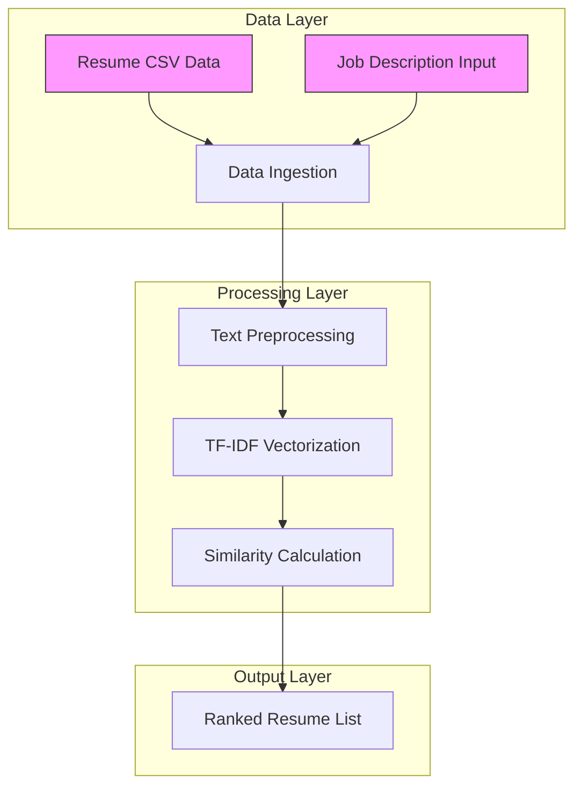
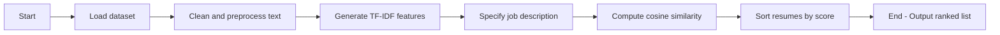

# Resume Screening AI**
 **Deploy Link :https://resume-screening-ai-m2duh4xr8i27d9ydvxr7uk.streamlit.app/

Automatic resume ranking system** that helps recruiters quickly shortlist candidates
> by comparing resumes against job descriptions using natural language processing.

---

##  Project Overview

Recruiting is time‑consuming, especially when sifting through hundreds of resumes. This
project provides a prototype AI pipeline that:

1. Ingests a corpus of resumes.
2. Cleans and vectorizes text data using industry-standard NLP techniques.
3. Computes similarity between each resume and a target job description.
4. Outputs a ranked list of candidates to streamline hiring decisions.

The implementation is designed as an educational proof‑of‑concept and can be
extended to a production‑grade application.

---

##  Key Features

-  Data ingestion and exploratory analysis
-  Text preprocessing (lowercasing, punctuation removal, stop‑word filtering)
-  TF–IDF vectorization of resume text
-  Cosine similarity scoring against a sample job description
-  Sorted ranking of candidate resumes

---

##  Technologies & Dependencies

| Category | Tools / Libraries |
|----------|-------------------|
| Language | Python 3.11       |
| Data      | pandas, numpy     |
| NLP       | NLTK, scikit-learn (`TfidfVectorizer`) |
| Environment | Jupyter Notebook / Google Colab |

Additional utilities:
- `re` for regular expressions

> A virtual environment is recommended (`venv`, `conda`, etc.) to isolate
> dependencies.

---

##  Dataset

The dataset used for this project is a simple CSV containing sample resumes
mapped to job categories.

- **File**: `data/resume_data.csv` (or `resume_dataset.csv` in earlier notes)
- **Records**: 169 rows
- **Columns**: `Category`, `Resume`

> This repository does not contain private or real candidates; the data is
> fabricated for demonstration purposes.

---

## ⚙️ Setup & Installation

1. **Clone the repository**
   ```bash
   git clone <repo-url>
   cd Resume-Screening-AI
   ```

2. **Create and activate a virtual environment**:
   ```powershell
   python -m venv env
   .\env\Scripts\activate   # Windows
   source env/bin/activate     # macOS/Linux
   ```

3. **Install required packages**:
   ```bash
   pip install -r requirements.txt
   ```

   *If a `requirements.txt` file is not present, you can manually install:*
   ```bash
   pip install pandas nltk scikit-learn
   ```

4. **Download NLTK resources** (if not already available):
   ```python
   import nltk
   nltk.download('stopwords')
   ```

---

## 📖 Usage

The core logic is implemented in a Jupyter notebook located at:
`notebooks/Day1_Day2_ResumeScreening.ipynb`.

Steps to run:

1. Open the notebook using Jupyter or Colab:
   ```bash
   jupyter notebook notebooks/Day1_Day2_ResumeScreening.ipynb
   ```

2. Execute cells sequentially. Key sections of the notebook:
   - **Data loading & exploration**
   - **Text cleaning and preprocessing**
   - **TF–IDF vectorization**
   - **Job description matching and ranking**

3. Modify the sample job description or extend the notebook with additional
   features (e.g. PDF parsing, classification models).

---

## 📊 Output Examples

- **TF–IDF matrix** (sparse matrix representation)
- **Similarity scores** for each resume relative to the job description
- **Ranked candidates** (highest-scoring resumes first)

Screenshots or exported CSVs can be added here for clarity.

---

##  Architecture & Workflow

### System Architecture



### Workflow



The diagrams above illustrate the major components and data flow of the project,
highlighting how resumes are transformed and compared against job descriptions.

---

##  Future Enhancements

The current prototype can be expanded along several dimensions:

1. **Resume file support** – parse PDF/DOCX documents instead of plain text.
2. **Classification/Matching model** – train supervised algorithms to predict
   best-fit roles.
3. **Web UI** – deploy as a Streamlit/Flask/Django application.
4. **Explainability** – highlight keywords and phrases responsible for scores.
5. **Integration with ATS** – connect the pipeline to Applicant Tracking Systems.

---

## 🤝 Contributing

Contributions are welcome! Please follow these guidelines:

1. Fork the repository and create a feature branch.
2. Make changes and include tests where appropriate.
3. Submit a pull request with a clear description of your work.

---

## 📄 License

This project is licensed under the [MIT License](LICENSE).

---

## 📬 Contact

For questions or feedback, reach out to:

- **Author**: Kavana S Harthal,Preethi kumari,Tejaswini r
  

---

Thank you for exploring the Resume Screening AI project! 🙌

